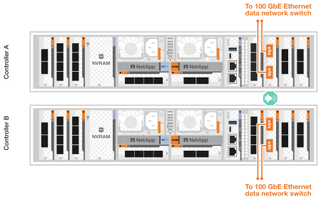
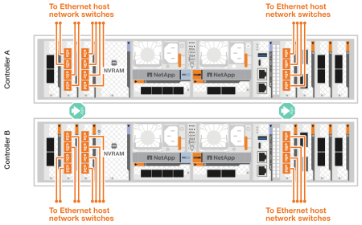
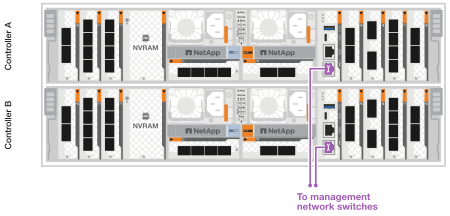
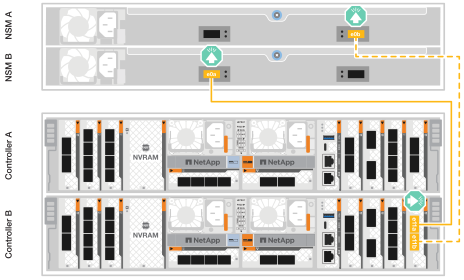
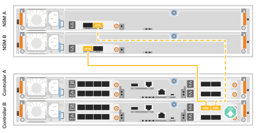

= Verkabeln Sie die Hardware für Ihr ASA r2 Storage-System
:allow-uri-read: 
:icons: font
:imagesdir: ../media/

[role="lead"]
Nachdem Sie die Rack-Hardware für das ASA r2 Storage-System installiert haben, installieren Sie die Netzwerkkabel für die Controller und verbinden Sie die Kabel zwischen den Controllern und Storage-Shelfs.

.Bevor Sie beginnen
Wenden Sie sich an Ihren Netzwerkadministrator, um Informationen über das Anschließen des Speichersystems an die Netzwerk-Switches zu erhalten.

.Über diese Aufgabe
* Diese Verfahren zeigen gängige Konfigurationen. Die jeweilige Verkabelung hängt von den für das Speichersystem bestellten Komponenten ab. Ausführliche Informationen zur Konfiguration und zur Steckplatzpriorität finden Sie unter link:https://hwu.netapp.com["NetApp Hardware Universe"^].
* Die Verfahren zur Verkabelung von Cluster/HA und Host-Netzwerk zeigen gemeinsame Konfigurationen.
+
Wenn Ihre Konfiguration in den Verkabelungsverfahren nicht angezeigt wird, gehen Sie zu link:https://hwu.netapp.com["NetApp Hardware Universe"^] für umfassende Konfigurations- und Steckplatzprioritätsinformationen, um Ihr Speichersystem richtig zu verkabeln.

* Wenn Sie ein ASA A1K-, ASA A70- oder ASA A90-Speichersystem haben, sind die E/A-Steckplätze von 1 bis 11 nummeriert.
+
image::../media/drw_a1K_back_slots_labeled_ieops-2162.svg[Steckplatznummerierung auf einem ASA A1K ASA A70 und ASA A90 Controller]

* Die Verkabelungsgrafiken haben Pfeilsymbole, die die richtige Ausrichtung (nach oben oder unten) des Kabelsteckers zeigen, wenn ein Anschluss in einen Anschluss eingesetzt wird.
+
Wenn Sie den Anschluss einsetzen, sollten Sie das Gefühl haben, dass er einrasten kann. Wenn Sie nicht das Gefühl haben, dass er klickt, entfernen Sie ihn, drehen Sie ihn um und versuchen Sie es erneut.

+
image:../media/drw_cable_pull_tab_direction_ieops-1699.svg["Richtung der Zuglasche des Kabels"]

* Wenn Sie eine Verkabelung zu einem optischen Switch vornehmen, stecken Sie den optischen Transceiver in den Controller-Port, bevor Sie ihn mit dem Switch-Port verbinden.

== Schritt 1: Cluster/HA-Verbindungen verkabeln

Verkabeln Sie die Controller mit dem ONTAP-Cluster. Dieses Verfahren hängt von Ihrem Speichersystemmodell und Ihrer I/O-Modulkonfiguration ab.

NOTE: Der Cluster-Interconnect-Verkehr und der HA Traffic nutzen dieselben physischen Ports.

[role="tabbed-block"]
====
.A1K
--
Erstellen Sie die ONTAP-Cluster-Verbindungen. Bei Clustern ohne Switch verbinden Sie die Controller miteinander. Verbinden Sie bei geswitchten Clustern die Controller mit den Cluster-Netzwerk-Switches.

.Cluster-Verkabelung ohne Switch
[%collapsible]
=====
Verwenden Sie das Cluster/HA-Verbindungskabel, um die Ports e1a mit e1a und die Ports e7a mit e7a zu verbinden.

.Schritte
. Schließen Sie den Port e1a an Controller A an den Port e1a an Controller B. an
. Verbinden Sie Port e7a an Controller A mit Port e1a an Controller B.
+
*Cluster/HA Verbindungskabel*

+
image::../media/oie_cable_25Gb_Ethernet_SFP28_IEOPS-1069.svg[Cluster HA-Kabel]

+
image::../media/drw_a1k_tnsc_cluster_cabling_ieops-1648.svg[Verkabelungsdiagramm für Cluster mit zwei Nodes ohne Switches]

=====
.Switch-Cluster-Verkabelung
[%collapsible]
=====
Verwenden Sie das 100-GbE-Kabel, um die Ports e1a an e1a und die Ports e7a an e7a anzuschließen.

NOTE: Switched-Cluster-Konfigurationen werden ab 9.16.1 unterstützt.

.Schritte
. Verbinden Sie Port e1a an Controller A und Port e1a an Controller B mit Cluster-Netzwerk-Switch A.
. Verbinden Sie Port e7a an Controller A und Port e7a an Controller B mit Cluster-Netzwerk-Switch B.
+
*100-GbE-Kabel*

+
image::../media/oie_cable100_gbe_qsfp28.png[100-GB-Kabel]

+
image::../media/drw_a1k_switched_cluster_cabling_ieops-1652.svg[Verkabeln Sie Cluster-Verbindungen mit dem Cluster-Netzwerk]

=====
--
.A70 und A90
--
Erstellen Sie die ONTAP-Cluster-Verbindungen. Bei Clustern ohne Switch verbinden Sie die Controller miteinander. Verbinden Sie bei geswitchten Clustern die Controller mit den Cluster-Netzwerk-Switches.

.Cluster-Verkabelung ohne Switch
[%collapsible]
=====
Verwenden Sie das Cluster/HA-Verbindungskabel, um die Ports e1a mit e1a und die Ports e7a mit e7a zu verbinden.

.Schritte
. Schließen Sie den Port e1a an Controller A an den Port e1a an Controller B. an
. Verbinden Sie Port e7a an Controller A mit Port e1a an Controller B.
+
*Cluster/HA Verbindungskabel*

+
image::../media/oie_cable_25Gb_Ethernet_SFP28_IEOPS-1069.svg[Cluster HA-Kabel]

+
image::../media/drw_70-90_tnsc_cluster_cabling_ieops-1653.svg[Verkabelungsdiagramm für Cluster mit zwei Nodes ohne Switches]

=====
.Switch-Cluster-Verkabelung
[%collapsible]
=====
Verwenden Sie das 100-GbE-Kabel, um die Ports e1a an e1a und die Ports e7a an e7a anzuschließen.

NOTE: Switched-Cluster-Konfigurationen werden ab 9.16.1 unterstützt.

.Schritte
. Verbinden Sie Port e1a an Controller A und Port e1a an Controller B mit Cluster-Netzwerk-Switch A.
. Verbinden Sie Port e7a an Controller A und Port e7a an Controller B mit Cluster-Netzwerk-Switch B.
+
*100-GbE-Kabel*

+
image::../media/oie_cable100_gbe_qsfp28.png[100-GB-Kabel]

+
image::../media/drw_70-90_switched_cluster_cabling_ieops-1657.svg[Verkabeln Sie Cluster-Verbindungen mit dem Cluster-Netzwerk]

=====
--
.A20, A30 UND A50
--
Erstellen Sie die ONTAP-Cluster-Verbindungen. Bei Clustern ohne Switch verbinden Sie die Controller miteinander. Verbinden Sie bei geswitchten Clustern die Controller mit den Cluster-Netzwerk-Switches.

*Cluster-Verkabelung ohne Switches*

Verbinden Sie die Controller miteinander, um die ONTAP-Cluster-Verbindungen zu erstellen.

.ASA A30 und ASA A50 mit zwei 40/100-GbE-I/O-Modulen mit 2 Ports
[%collapsible]
=====
.Schritte
. Verbinden Sie die Cluster/HA Interconnect-Verbindungen:
+

NOTE: Der Cluster-Interconnect-Verkehr und der HA Traffic nutzen dieselben physischen Ports (auf den I/O-Modulen in den Steckplätzen 2 und 4). Die Ports sind 40/100 GbE.

+
.. Controller A-Port e2a an Controller B-Port e2a anschließen.
.. Verbinden Sie den Controller A-Port e4a mit dem Controller B-Port e4a.
+

NOTE: Die I/O-Modulports e2b und e4b sind nicht verwendet und stehen für die Host-Netzwerk-Konnektivität zur Verfügung.

+
*100 GbE Cluster/HA Interconnect-Kabel*

+
image::../media/oie_cable100_gbe_qsfp28.png[Cluster HA 100-GbE-Kabel]

+
image::../media/drw_isi_a30-50_switchless_2p_100gbe_2card_cabling_ieops-2011.svg[Diagramm der Switch-losen Cluster-Verkabelung bei a30 und a50 mit zwei 100-gbe-io-Modulen]

=====
.ASA A30 und ASA A50 mit einem 40/100-GbE-I/O-Modul mit 2 Anschlüssen
[%collapsible]
=====
.Schritte
. Verbinden Sie die Cluster/HA Interconnect-Verbindungen:
+

NOTE: Der Cluster-Interconnect-Verkehr und der HA-Verkehr teilen sich dieselben physischen Ports (auf dem I/O-Modul in Steckplatz 4). Die Ports sind 40/100 GbE.

+
.. Verbinden Sie den Controller A-Port e4a mit dem Controller B-Port e4a.
.. Verbinden Sie den Controller A-Port e4b mit dem Controller B-Port e4b.
+
*100 GbE Cluster/HA Interconnect-Kabel*

+
image::../media/oie_cable100_gbe_qsfp28.png[Cluster HA 100-GbE-Kabel]

+
image::../media/drw_isi_a30-50_switchless_2p_100gbe_1card_cabling_ieops-1925.svg[Diagramm der Switch-losen Cluster-Verkabelung bei a30 und a50 mit einem 100-gbe-io-Modul]

=====
.ASA A20 mit einem 10/25-GbE-I/O-Modul mit 2 Ports
[%collapsible]
=====
.Schritte
. Verbinden Sie die Cluster/HA Interconnect-Verbindungen:
+

NOTE: Der Cluster-Interconnect-Verkehr und der HA-Verkehr teilen sich dieselben physischen Ports (auf dem I/O-Modul in Steckplatz 4). Die Ports sind 10/25 GbE.

+
.. Verbinden Sie den Controller A-Port e4a mit dem Controller B-Port e4a.
.. Verbinden Sie den Controller A-Port e4b mit dem Controller B-Port e4b.
+
*25 GbE Cluster/HA Interconnect-Kabel*

+
image:../media/oie_cable_sfp_gbe_copper.png["GbE SFP Kupfer Connector, Breite=100px"]

+
image::../media/drw_isi_a20_switchless_2p_25gbe_cabling_ieops-2018.svg[a20-Clusterverkabelungsdiagramm ohne Switch mit einem 25-gbe-io-Modul]

=====
*Switch-Cluster-Verkabelung*

Verbinden Sie die Controller mit den Cluster-Netzwerk-Switches, um die ONTAP-Cluster-Verbindungen zu erstellen.

.ASA A30 oder ASA A50 mit zwei 40/100-GbE-I/O-Modulen mit 2 Ports
[%collapsible]
=====
.Schritte
. Verkabeln der Cluster/HA Interconnect-Verbindungen:
+

NOTE: Der Cluster-Interconnect-Verkehr und der HA Traffic nutzen dieselben physischen Ports (auf den I/O-Modulen in den Steckplätzen 2 und 4). Die Ports sind 40/100 GbE.

+
.. Verbinden Sie Port e4a des Controllers A mit dem Cluster-Netzwerk-Switch A.
.. Verbinden Sie Port e2a von Controller A mit Cluster-Netzwerk-Switch B.
.. Verbinden Sie Port e4a des Controllers B mit dem Cluster-Netzwerk-Switch A.
.. Verbinden Sie Port e2a des Controllers B mit dem Cluster-Netzwerk-Switch B.
+

NOTE: Die I/O-Modulports e2b und e4b sind nicht verwendet und stehen für die Host-Netzwerk-Konnektivität zur Verfügung.

+
*40/100 GbE Cluster/HA Interconnect-Kabel*

+
image::../media/oie_cable100_gbe_qsfp28.png[Cluster HA 40/100-GbE-Kabel]

+
image::../media/drw_isi_a30-50_switched_2p_100gbe_2card_cabling_ieops-2013.svg[Diagramm der Switch-Cluster-Verkabelung bei a30 und a50 mit zwei 100-gbe-io-Modulen]

=====
.ASA A30 oder ASA A50 mit einem 40/100-GbE-I/O-Modul mit 2 Anschlüssen
[%collapsible]
=====
.Schritte
. Verkabeln Sie die Controller mit den Cluster-Netzwerk-Switches:
+

NOTE: Der Cluster-Interconnect-Verkehr und der HA-Verkehr teilen sich dieselben physischen Ports (auf dem I/O-Modul in Steckplatz 4). Die Ports sind 40/100 GbE.

+
.. Verbinden Sie Port e4a des Controllers A mit dem Cluster-Netzwerk-Switch A.
.. Verbinden Sie Port e4b von Controller A mit Cluster-Netzwerk-Switch B.
.. Verbinden Sie Port e4a des Controllers B mit dem Cluster-Netzwerk-Switch A.
.. Verbinden Sie Port e4b des Controllers B mit dem Cluster-Netzwerk-Switch B.
+
*40/100 GbE Cluster/HA Interconnect-Kabel*

+
image::../media/oie_cable100_gbe_qsfp28.png[Cluster HA 40/100-GbE-Kabel]

+
image::../media/drw_isi_a30-50_2p_100gbe_1card_switched_cabling_ieops-1926.svg[Verkabeln Sie Cluster-Verbindungen mit dem Cluster-Netzwerk]

=====
.ASA A20 mit einem 10/25-GbE-I/O-Modul mit 2 Ports
[%collapsible]
=====
. Verkabeln Sie die Controller mit den Cluster-Netzwerk-Switches:
+

NOTE: Der Cluster-Interconnect-Verkehr und der HA-Verkehr teilen sich dieselben physischen Ports (auf dem I/O-Modul in Steckplatz 4). Die Ports sind 10/25 GbE.

+
.. Verbinden Sie Port e4a des Controllers A mit dem Cluster-Netzwerk-Switch A.
.. Verbinden Sie Port e4b von Controller A mit Cluster-Netzwerk-Switch B.
.. Verbinden Sie Port e4a des Controllers B mit dem Cluster-Netzwerk-Switch A.
.. Verbinden Sie Port e4b des Controllers B mit dem Cluster-Netzwerk-Switch B.
+
*10/25 GbE Cluster/HA Interconnect-Kabel*

+
image::../media/oie_cable_sfp_gbe_copper.png[GbE SFP Kupfer Connector]

+
image::../media/drw_isi_a20_switched_2p_25gbe_cabling_ieops-2019.svg[Verkabelungsdiagramm für a20-Switch-Cluster mit einem 25-gbe-io-Modul]

=====
--
.C30
--
Erstellen Sie die ONTAP-Cluster-Verbindungen. Bei Clustern ohne Switch verbinden Sie die Controller miteinander. Verbinden Sie bei geswitchten Clustern die Controller mit den Cluster-Netzwerk-Switches.

*Cluster-Verkabelung ohne Switches*

Verbinden Sie die Controller miteinander, um die ONTAP-Cluster-Verbindungen zu erstellen.

.ASA C30 mit zwei 2-Port 40/100 GbE I/O-Modulen
[%collapsible]
=====
.Schritte
. Verkabeln der Cluster/HA Interconnect-Verbindungen:
+

NOTE: Der Cluster-Interconnect-Verkehr und der HA Traffic nutzen dieselben physischen Ports (auf den I/O-Modulen in den Steckplätzen 2 und 4). Die Ports sind 40/100 GbE.

+
.. Controller A-Port e2a an Controller B-Port e2a anschließen.
.. Verbinden Sie den Controller A-Port e4a mit dem Controller B-Port e4a.
+

NOTE: Die I/O-Modulports e2b und e4b sind nicht verwendet und stehen für die Host-Netzwerk-Konnektivität zur Verfügung.

+
*100 GbE Cluster/HA Interconnect-Kabel*

+
image::../media/oie_cable100_gbe_qsfp28.png[Cluster HA 100-GbE-Kabel]

+
image::../media/drw_isi_a30-50_switchless_2p_100gbe_2card_cabling_ieops-2011.svg[Diagramm der Switch-losen Cluster-Verkabelung bei a30 und a50 mit zwei 100-gbe-io-Modulen]

=====
.ASA C30 mit einem 40/100-GbE-I/O-Modul mit 2 Ports
[%collapsible]
=====
.Schritte
. Verkabeln der Cluster/HA Interconnect-Verbindungen:
+

NOTE: Der Cluster-Interconnect-Verkehr und der HA-Verkehr teilen sich dieselben physischen Ports (auf dem I/O-Modul in Steckplatz 4). Die Ports sind 40/100 GbE.

+
.. Verbinden Sie den Controller A-Port e4a mit dem Controller B-Port e4a.
.. Verbinden Sie den Controller A-Port e4b mit dem Controller B-Port e4b.
+
*100 GbE Cluster/HA Interconnect-Kabel*

+
image::../media/oie_cable100_gbe_qsfp28.png[Cluster HA 100-GbE-Kabel]

+
image::../media/drw_isi_a30-50_switchless_2p_100gbe_1card_cabling_ieops-1925.svg[C30 Switchless-Cluster-Verkabelungsdiagramm mit einem 100-GBit/s-E/A-Modul]

=====
*Switch-Cluster-Verkabelung*

Verbinden Sie die Controller mit den Cluster-Netzwerk-Switches, um die ONTAP-Cluster-Verbindungen zu erstellen.

.ASA C30 mit zwei 2-Port 40/100 GbE I/O-Modulen
[%collapsible]
=====
.Schritte
. Verkabeln der Cluster/HA Interconnect-Verbindungen:
+

NOTE: Der Cluster-Interconnect-Verkehr und der HA Traffic nutzen dieselben physischen Ports (auf den I/O-Modulen in den Steckplätzen 2 und 4). Die Ports sind 40/100 GbE.

+
.. Verbinden Sie Port e4a des Controllers A mit dem Cluster-Netzwerk-Switch A.
.. Verbinden Sie Port e2a von Controller A mit Cluster-Netzwerk-Switch B.
.. Verbinden Sie Port e4a des Controllers B mit dem Cluster-Netzwerk-Switch A.
.. Verbinden Sie Port e2a des Controllers B mit dem Cluster-Netzwerk-Switch B.
+

NOTE: Die I/O-Modulports e2b und e4b sind nicht verwendet und stehen für die Host-Netzwerk-Konnektivität zur Verfügung.

+
*40/100 GbE Cluster/HA Interconnect-Kabel*

+
image::../media/oie_cable100_gbe_qsfp28.png[Cluster HA 40/100-GbE-Kabel]

+
image::../media/drw_isi_a30-50_switched_2p_100gbe_2card_cabling_ieops-2013.svg[C30 Switched Cluster-Verkabelungsdiagramm mit zwei 100-GBit-E/A-Modulen]

=====
.ASA C30 mit einem 40/100-GbE-I/O-Modul mit 2 Ports
[%collapsible]
=====
.Schritte
. Verbinden Sie die Controller mit den Cluster-Netzwerk-Switches:
+

NOTE: Der Cluster-Interconnect-Verkehr und der HA-Verkehr teilen sich dieselben physischen Ports (auf dem I/O-Modul in Steckplatz 4). Die Ports sind 40/100 GbE.

+
.. Verbinden Sie Port e4a des Controllers A mit dem Cluster-Netzwerk-Switch A.
.. Verbinden Sie Port e4b von Controller A mit Cluster-Netzwerk-Switch B.
.. Verbinden Sie Port e4a des Controllers B mit dem Cluster-Netzwerk-Switch A.
.. Verbinden Sie Port e4b des Controllers B mit dem Cluster-Netzwerk-Switch B.
+
*40/100 GbE Cluster/HA Interconnect-Kabel*

+
image::../media/oie_cable100_gbe_qsfp28.png[Cluster HA 40/100-GbE-Kabel]

+
image::../media/drw_isi_a30-50_2p_100gbe_1card_switched_cabling_ieops-1926.svg[Verkabeln Sie Cluster-Verbindungen mit dem Cluster-Netzwerk]

=====
--
====

== Schritt 2: Verkabeln Sie die Host-Netzwerkverbindungen

Verbinden Sie die Controller mit Ihrem Host-Netzwerk.

Dieses Verfahren hängt von Ihrem Speichersystemmodell und Ihrer I/O-Modulkonfiguration ab.

[role="tabbed-block"]
====
.A1K
--
Verbinden Sie die Ethernet-Modulports mit Ihrem Hostnetzwerk.

Im Folgenden finden Sie einige typische Beispiele für eine Verkabelung im Host-Netzwerk. Informationen zu Ihrer spezifischen Systemkonfiguration finden Sie unter link:https://hwu.netapp.com["NetApp Hardware Universe"^] .

.Schritte
. Verbinden Sie die Ports e9a und e9b mit dem Ethernet-Datennetzwerk-Switch.
+

NOTE: Verwenden Sie für maximale Systemperformance für Cluster- und HA-Datenverkehr die Ports e1b und e7b nicht für Host-Netzwerkverbindungen. Verwenden Sie eine separate Hostkarte, um die Leistung zu maximieren.

+
*100-GbE-Kabel*

+
image::../media/oie_cable_sfp_gbe_copper.svg[100-GB-Ethernet-Kabel]

+

. Verbinden Sie Ihre 10/25 GbE Host-Netzwerk-Switches.
+
*10/25 GbE Host*

+
image::../media/oie_cable_sfp_gbe_copper.svg[10 GB Ethernet-Kabel]

+

--
.A70 und A90
--
Verbinden Sie die Ethernet-Modulports mit Ihrem Hostnetzwerk.

Im Folgenden finden Sie einige typische Beispiele für eine Verkabelung im Host-Netzwerk. Informationen zu Ihrer spezifischen Systemkonfiguration finden Sie unter link:https://hwu.netapp.com["NetApp Hardware Universe"^] .

.Schritte
. Verbinden Sie die Ports e9a und e9b mit dem Ethernet-Datennetzwerk-Switch.
+

NOTE: Verwenden Sie für maximale Systemperformance für Cluster- und HA-Datenverkehr die Ports e1b und e7b nicht für Host-Netzwerkverbindungen. Verwenden Sie eine separate Hostkarte, um die Leistung zu maximieren.

+
*100-GbE-Kabel*

+
image::../media/oie_cable_sfp_gbe_copper.svg[100-GB-Ethernet-Kabel]

+
image::../media/drw_70-90_network_cabling1_ieops-1654.svg[Kabel zum 100-GB-Ethernet-Netzwerk]

. Verbinden Sie Ihre 10/25 GbE Host-Netzwerk-Switches.
+
*4 Ports, 10/25 GbE Host*

+
image::../media/oie_cable_sfp_gbe_copper.svg[10/25-GB-Kabel]

+
image::../media/drw_70-90_network_cabling2_ieops-1655.svg[Kabel zum 100-GB-Ethernet-Netzwerk]

--
.A20, A30 UND A50
--
Verbinden Sie die Ethernet-Modulports oder die Fibre-Channel-Modulports (FC) mit Ihrem Hostnetzwerk.

*Ethernet-Host-Verkabelung*

.ASA A30 und ASA A50 mit zwei 40/100-GbE-I/O-Modulen mit 2 Ports
[%collapsible]
=====
Verbinden Sie an jedem Controller die Ports e2b und e4b mit den Ethernet-Host-Netzwerk-Switches.

NOTE: Die Ports an E/A-Modulen in Steckplatz 2 und 4 sind 40/100 GbE (Host-Konnektivität ist 40/100 GbE).

*40/100-GbE-Kabel*

image::../media/oie_cable_sfp_gbe_copper.png[40/100-GB-Kabel]

image::../media/drw_isi_a30-50_host_2p_40-100gbe_2card_cabling_ieops-2014.svg[Verkabelung zu 40/100-gbe-ethernet-Host-Netzwerk-Switches]

=====
.ASA A20, A30 und A50 mit einem 4-Port 10/25 GbE I/O-Modul
[%collapsible]
=====
Verbinden Sie auf jedem Controller die Ports e2a, e2b, e2c und e2d mit den Ethernet-Host-Netzwerk-Switches.

*10/25-GbE-Kabel*

image:../media/oie_cable_sfp_gbe_copper.png["GbE SFP Kupfer Connector, Breite=100px"]

image::../media/drw_isi_a30-50_host_2p_40-100gbe_1card_cabling_ieops-1923.svg[Verkabelung zu 40/100-gbe-ethernet-Host-Netzwerk-Switches]

=====
*FC-Hostverkabelung*

.ASA A20, A30 und A50 mit einem 4-Port 64 Gb/s FC I/O-Modul
[%collapsible]
=====
Verbinden Sie auf jedem Controller die Ports 1a, 1b, 1c und 1d mit den FC-Host-Netzwerk-Switches.

*64 Gbit/s FC-Kabel*

image:../media/oie_cable_sfp_gbe_copper.png["64-GB-fc-Kabel, Breite=100 px"]

image::../media/drw_isi_a30-50_4p_64gb_fc_1card_cabling_ieops-1924.svg[Verkabelung zu 64 gb fc Host Netzwerk-Switches]

=====
--
.C30
--
Verbinden Sie die Ethernet-Modulports oder die Fibre-Channel-Modulports (FC) mit Ihrem Hostnetzwerk.

*Ethernet-Host-Verkabelung*

.ASA C30 mit zwei 2-Port 40/100 GbE I/O-Modulen
[%collapsible]
=====
.Schritte
. Verbinden Sie an jedem Controller die Ports e2b und e4b mit den Ethernet-Host-Netzwerk-Switches.
+

NOTE: Die Ports an E/A-Modulen in Steckplatz 2 und 4 sind 40/100 GbE (Host-Konnektivität ist 40/100 GbE).

+
*40/100-GbE-Kabel*

+
image::../media/oie_cable_sfp_gbe_copper.png[40/100-GB-Kabel]

+
image::../media/drw_isi_a30-50_host_2p_40-100gbe_2card_cabling_ieops-2014.svg[Verkabelung zu 40/100-gbe-ethernet-Host-Netzwerk-Switches]

=====
.ASA C30 mit einem 10/25-GbE-I/O-Modul mit 4 Ports
[%collapsible]
=====
.Schritte
. Verkabeln Sie bei jedem Controller die Ports e2a, e2b, e2c und e2d mit den Ethernet-Host-Netzwerk-Switches.
+
*10/25-GbE-Kabel*

+
image:../media/oie_cable_sfp_gbe_copper.png["GbE SFP Kupfer Connector, Breite=100px"]

+
image::../media/drw_isi_a30-50_host_2p_40-100gbe_1card_cabling_ieops-1923.svg[Verkabelung zu 40/100-gbe-ethernet-Host-Netzwerk-Switches]

=====
.ASA C30 mit einem 4-Port 64 Gb/s FC I/O-Modul
[%collapsible]
=====
.Schritte
. Verkabeln Sie an jedem Controller die Ports 1a, 1b, 1c und 1d mit den FC-Host-Netzwerk-Switches.
+
*64 Gbit/s FC-Kabel*

+
image:../media/oie_cable_sfp_gbe_copper.png["64-GB-fc-Kabel, Breite=100 px"]

+
image::../media/drw_isi_a30-50_4p_64gb_fc_1card_cabling_ieops-1924.svg[Verkabelung zu 64 gb fc Host Netzwerk-Switches]

=====
--
====

== Schritt 3: Verkabelung der Management-Netzwerkverbindungen

Verbinden Sie die Controller mit dem Managementnetzwerk.

Informationen zum Anschließen des Speichersystems an die Management-Netzwerk-Switches erhalten Sie von Ihrem Netzwerkadministrator.

[role="tabbed-block"]
====
.A1K
--
Verwenden Sie die 1000BASE-T RJ-45-Kabel, um die Management-Ports (Schraubenschlüssel) an den einzelnen Controllern mit den Managementnetzwerk-Switches zu verbinden.

image::../media/oie_cable_rj45.svg[RJ-45-Kabel]

* 1000BASE-T RJ-45 KABEL*

image::../media/drw_a1k_management_connection_ieops-1651.svg[Stellen Sie eine Verbindung mit dem Managementnetzwerk her]

IMPORTANT: Stecken Sie die Netzkabel noch nicht ein.

--
.A70 und A90
--
Verwenden Sie die 1000BASE-T RJ-45-Kabel, um die Management-Ports (Schraubenschlüssel) an den einzelnen Controllern mit den Managementnetzwerk-Switches zu verbinden.

image::../media/oie_cable_rj45.svg[RJ45-Kabel]

* 1000BASE-T RJ-45 KABEL*

IMPORTANT: Stecken Sie die Netzkabel noch nicht ein.

--
.A20, A30 UND A50
--
Verbinden Sie die Management-Ports (Schraubenschlüssel) an den einzelnen Controllern mit den Managementnetzwerk-Switches.

* 1000BASE-T RJ-45 KABEL*

image::../media/oie_cable_rj45.png[RJ-45-Kabel]

image::../media/drw_isi_g_wrench_cabling_ieops-1928.svg[Stellen Sie eine Verbindung mit dem Managementnetzwerk her]

IMPORTANT: Stecken Sie die Netzkabel noch nicht ein.

--
.C30
--
Verbinden Sie die Management-Ports (Schraubenschlüssel) an den einzelnen Controllern mit den Managementnetzwerk-Switches.

* 1000BASE-T RJ-45 KABEL*

image::../media/oie_cable_rj45.png[RJ-45-Kabel]

image::../media/drw_isi_g_wrench_cabling_ieops-1928.svg[Stellen Sie eine Verbindung mit dem Managementnetzwerk her]

IMPORTANT: Stecken Sie die Netzkabel noch nicht ein.

--
====

== Schritt 4: Verkabeln Sie die Shelf-Verbindungen

Die folgenden Verkabelungsverfahren zeigen, wie Sie Ihre Controller mit einem Storage Shelf verbinden.

Die maximale Anzahl der unterstützten Einschübe für Ihr Speichersystem und alle Verkabelungsoptionen, wie link:https://hwu.netapp.com["NetApp Hardware Universe"^]z. B. optische und Switch-Attached, finden Sie unter .

[role="tabbed-block"]
====
.A1K
--
Die AFF A1K Speichersysteme unterstützen NS224-Shelves mit dem Modul NSM100 oder NSM100B. Die Hauptunterschiede zwischen den Modulen sind:

* NSM100-Regalmodule verwenden die integrierten Ports e0a und e0b.
* NSM100B-Shelf-Module verwenden die Ports e1a und e1b in Steckplatz 1.

Das folgende Verkabelungsbeispiel zeigt NSM100-Module in den NS224-Schränken, wenn auf die Anschlüsse der Regalmodule verwiesen wird.

Wählen Sie eine der folgenden Verkabelungsoptionen, die Ihrem Setup entsprechen.

.Option 1: Ein NS224 Storage-Shelf
[%collapsible]
=====
Verbinden Sie jeden Controller mit den NSM-Modulen im NS224-Shelf. Die Grafik zeigt die Verkabelung von den einzelnen Controllern: Die Verkabelung von Controller A wird blau und die Verkabelung von Controller B gelb dargestellt.

.Schritte
. Verbinden Sie auf Controller A die folgenden Ports:
+
.. Verbinden Sie Port e11a mit NSM A Port e0a.
.. Verbinden Sie Port e11b mit Port NSM B Port e0b.
+
image:../media/drw_a1k_1shelf_cabling_a_ieops-1703.svg["Controller A e11a und e11b zu einem einzelnen NS224 Shelf"]

. Verbinden Sie an Controller B die folgenden Ports:
+
.. Verbinden Sie Port e11a mit NSM B Port e0a.
.. Verbinden Sie Port e11b mit NSM A Port e0b.
+
image:../media/drw_a1k_1shelf_cabling_b_ieops-1704.svg["Verbinden Sie die Controller B-Ports e11a und e11b mit einem einzelnen NS224-Regal"]

=====
.Option 2: Zwei NS224 Storage-Shelfs
[%collapsible]
=====
Verbinden Sie jeden Controller mit den NSM-Modulen beider NS224-Shelfs. Die Grafik zeigt die Verkabelung von den einzelnen Controllern: Die Verkabelung von Controller A wird blau und die Verkabelung von Controller B gelb dargestellt.

.Schritte
. Verbinden Sie auf Controller A die folgenden Ports:
+
.. Verbinden Sie Port e11a mit Shelf 1 NSM A Port e0a.
.. Verbinden Sie den Port e11b mit dem Shelf 2 NSM B-Port e0b.
.. Verbinden Sie Port e10a mit Shelf 2 NSM A Port E0a.
.. Verbinden Sie Port e10b mit Shelf 1 NSM A Port e0b.
+
image:../media/drw_a1k_2shelf_cabling_a_ieops-1705.svg["Controller-zu-Shelf-Verbindungen für Controller A"]

. Verbinden Sie an Controller B die folgenden Ports:
+
.. Verbinden Sie Port e11a mit Shelf 1 NSM B Port e0a.
.. Verbinden Sie Port e11b mit Shelf 2 NSM A Port e0b.
.. Verbinden Sie Port e10a mit Shelf 2 NSM B Port e0a.
.. Verbinden Sie Port e10b mit Shelf 1 NSM A Port e0b.
+
image:../media/drw_a1k_2shelf_cabling_b_ieops-1706.svg["Controller-zu-Shelf-Verbindungen für Controller B"]

=====
--
.A70 und A90
--
Die Speichersysteme AFF A70 und 90 unterstützen NS224-Shelves mit dem Modul NSM100 oder NSM100B. Die Hauptunterschiede zwischen den Modulen sind:

* NSM100-Regalmodule verwenden die integrierten Ports e0a und e0b.
* NSM100B-Shelf-Module verwenden die Ports e1a und e1b in Steckplatz 1.

Das folgende Verkabelungsbeispiel zeigt NSM100-Module in den NS224-Schränken, wenn auf die Anschlüsse der Regalmodule verwiesen wird.

Wählen Sie eine der folgenden Verkabelungsoptionen, die Ihrem Setup entsprechen.

.Option 1: Ein NS224 Storage-Shelf
[%collapsible]
=====
Verbinden Sie jeden Controller mit den NSM-Modulen im NS224-Shelf. Die Grafik zeigt die Verkabelung von den einzelnen Controllern: Die Verkabelung von Controller A wird blau und die Verkabelung von Controller B gelb dargestellt.

*100 GbE QSFP28 Kupferkabel*

image::../media/oie_cable100_gbe_qsfp28.svg[100-GbE-QSFP28-Kupferkabel]

.Schritte
. Verbinden Sie den Controller A-Port e11a mit dem NSM A-Port e0a.
. Verbinden Sie den Controller A-Port e11b mit dem Port NSM B Port e0b.
+
image:../media/drw_a70-90_1shelf_cabling_a_ieops-1731.svg["Controller A e11a und e11b zu einem einzelnen NS224 Shelf"]

. Verbinden Sie den Port e11a von Controller B mit dem Port e0a von NSM B.
. Verbinden Sie den Port e11b des Controllers B mit dem Port e0b des NSM A.
+

=====
.Option 2: Zwei NS224 Storage-Shelfs
[%collapsible]
=====
Verbinden Sie jeden Controller mit den NSM-Modulen beider NS224-Shelfs. Die Grafik zeigt die Verkabelung von den einzelnen Controllern: Die Verkabelung von Controller A wird blau und die Verkabelung von Controller B gelb dargestellt.

*100 GbE QSFP28 Kupferkabel*

image::../media/oie_cable100_gbe_qsfp28.svg[100-GbE-QSFP28-Kupferkabel]

.Schritte
. Verbinden Sie auf Controller A die folgenden Ports:
+
.. Verbinden Sie Port e11a mit Shelf 1, NSM A Port e0a.
.. Verbinden Sie den Port e11b mit Shelf 2, den NSM B Port e0b.
.. Verbinden Sie Port e8a mit Shelf 2, NSM A Port e0a.
.. Verbinden Sie Port e8b mit Shelf 1, NSM B Port e0b.
+
image:../media/drw_a70-90_2shelf_cabling_a_ieops-1733.svg["Controller-zu-Shelf-Verbindungen für Controller A"]

. Verbinden Sie an Controller B die folgenden Ports:
+
.. Verbinden Sie Port e11a mit Shelf 1, NSM B Port e0a.
.. Verbinden Sie Port e11b mit Shelf 2, NSM A Port e0b.
.. Verbinden Sie Port e8a mit Shelf 2, NSM B Port e0a.
.. Verbinden Sie Port e8b mit Shelf 1, NSM A Port e0b.
+
image:../media/drw_a70-90_2shelf_cabling_b_ieops-1734.svg["Controller-zu-Shelf-Verbindungen für Controller B"]

=====
--
.A20, A30 UND A50
--
Die Verkabelung des NS224-Regals zeigt NSM100B-Module anstelle von NSM100-Modulen. Die Verkabelung ist unabhängig vom Typ der verwendeten NSM-Module gleich, lediglich die Portnamen unterscheiden sich:

* NSM100B-Module verwenden die Ports e1a und e1b auf einem E/A-Modul in Steckplatz 1.
* NSM100-Module verwenden integrierte (Onboard-)Ports e0a und e0b.

Sie verkabeln jeden Controller mit jedem NSM-Modul im NS224-Regal mithilfe der Speicherkabel, die mit Ihrem Speichersystem geliefert wurden. Dabei kann es sich um den folgenden Kabeltyp handeln:

*100 GbE QSFP28 Kupferkabel*

image::../media/oie_cable100_gbe_qsfp28.png[100-GbE-QSFP28-Kupferkabel]

Die Grafik zeigt die Verkabelung von Controller A blau und Controller B gelb.

.Schritte
. Controller A mit dem Shelf verbinden:
+
.. Verbinden Sie den Controller A-Port e3a mit dem NSM A-Port e1a.
.. Den Controller A-Port e3b mit dem NSM B-Port e1b verbinden.
+
image:../media/drw_isi_g_1_ns224_controller_a_cabling_ieops-1945.svg["Controller A-Ports e3a und e3b sind mit einem NS224-Shelf verbunden"]

. Controller B mit dem Shelf verbinden:
+
.. Verbinden Sie den Port e3a von Controller B mit dem Port e1a von NSM B.
.. Verbinden Sie den Port e3b des Controllers B mit dem Port e1b des NSM A.
+

--
.C30
--
Die Verkabelung des NS224-Regals zeigt NSM100B-Module anstelle von NSM100-Modulen. Die Verkabelung ist unabhängig vom Typ der verwendeten NSM-Module gleich, lediglich die Portnamen unterscheiden sich:

* NSM100B-Module verwenden die Ports e1a und e1b auf einem E/A-Modul in Steckplatz 1.
* NSM100-Module verwenden integrierte (Onboard-)Ports e0a und e0b.

Sie verkabeln jeden Controller mit jedem NSM-Modul im NS224-Regal mithilfe der Speicherkabel, die mit Ihrem Speichersystem geliefert wurden. Dabei kann es sich um den folgenden Kabeltyp handeln:

*100 GbE QSFP28 Kupferkabel*

image::../media/oie_cable100_gbe_qsfp28.png[100-GbE-QSFP28-Kupferkabel]

Die Grafik zeigt die Verkabelung von Controller A blau und Controller B gelb.

.Schritte
. Controller A mit dem Shelf verbinden:
+
.. Verbinden Sie den Controller A-Port e3a mit dem NSM A-Port e1a.
.. Den Controller A-Port e3b mit dem NSM B-Port e1b verbinden.
+
image:../media/drw_isi_g_1_ns224_controller_a_cabling_ieops-1945.svg["Controller A-Ports e3a und e3b sind mit einem NS224-Shelf verbunden"]

. Controller B mit dem Shelf verbinden:
+
.. Verbinden Sie den Port e3a von Controller B mit dem Port e1a von NSM B.
.. Verbinden Sie den Port e3b des Controllers B mit dem Port e1b des NSM A.
+

--
====
.Was kommt als Nächstes?
Nachdem Sie die Speicher-Controller mit Ihrem Netzwerk verbunden und dann die Controller mit Ihren Speicher-Shelfs verbunden haben, Sie link:power-on-hardware.html["Schalten Sie das ASA r2-Speichersystem ein"].
