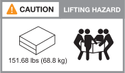

= Installationsanforderungen für ASA r2-Speichersysteme
:allow-uri-read: 
:icons: font
:imagesdir: ../media/

[role="lead"]
Überprüfen Sie die erforderlichen Geräte und die Vorsichtsmaßnahmen zum Anheben des ASA r2-Storage-Systems und der Storage-Shelfs.

== Für die Installation erforderliche Ausrüstung

Zur Installation des ASA r2-Speichersystems benötigen Sie die folgenden Geräte und Tools.

* Zugriff auf einen Webbrowser zur Konfiguration des Speichersystems
* Band für elektrostatische Entladung (ESD)
* Taschenlampe
* Laptop oder Konsole mit USB-/serieller Verbindung
* Büroklammer oder Kugelschreiber mit schmaler Spitze zum Einstellen von Regalbehelf-IDs
* Kreuzschlitzschraubendreher #2

== Vorsichtsmaßnahmen beim Anheben

ASA r2 Storage-Systeme und Storage-Shelfs sind schwer. Gehen Sie beim Anheben und Bewegen dieser Gegenstände vorsichtig vor.

=== Gewichte des Storage-Systems

Treffen Sie die erforderlichen Vorsichtsmaßnahmen, wenn Sie Ihr ASA r2-Speichersystem bewegen oder anheben.

[role="tabbed-block"]
====
.A1K
--
Ein ASA A1K Storage-System kann bis zu 28.5 kg (62.83 lbs) wiegen. Zum Anheben des Lagersystems zwei Personen oder einen Hydraulikhub verwenden.

image::../media/drw_a1k_weight_caution_ieops-1698.svg[ASA A1K Warnsymbol beim Anheben]

--
.A70 und A90
--
Ein ASA A70 oder ASA A90 Storage-System kann bis zu 68.8 kg (151.68 lbs) wiegen. Zum Anheben des Lagersystems vier Personen oder einen Hydraulikhub verwenden.

--
.A20, A30 UND A50
--
Ein ASA A20, ASA A30 oder ASA A50 Storage-System kann bis zu 27.9 kg (61.5 lbs) wiegen. Zum Anheben des Lagersystems zwei Personen oder einen Hydraulikhub verwenden.

image::../media/drw_g_lifting_weight_ieops-1831.svg[ASA A20,A30,or an A50 weight caution icon]

--
====

=== Gewicht des Lagerregals

Treffen Sie die erforderlichen Vorsichtsmaßnahmen, wenn Sie Ihr Regal bewegen oder anheben.

[role="tabbed-block"]
====
.NS224-Shelf
--
Ein NS224-Einschub kann bis zu 30.29 kg (66.78 lbs) wiegen. Zum Anheben des Regals zwei Personen oder einen Hydraulikhub verwenden. Halten Sie alle Komponenten im Regal (vorne und hinten), um ein Ausbalancieren des Regalgewichts zu vermeiden.

image::../media/drw_ns224_lifting_weight_ieops-1716.svg[NS224 NSM100 Vorsicht beim Anheben]

--
.NS224-Shelf mit NSM100B-Modulen
--
Ein NS224-Shelf mit NSM100B-Modulen kann bis zu 25.8 kg (56.8 lbs) wiegen. Zum Anheben des Regals zwei Personen oder einen Hydraulikhub verwenden. Halten Sie alle Komponenten im Regal (vorne und hinten), um ein Ausbalancieren des Regalgewichts zu vermeiden.

image::../media/drw_ns224_nsm100b_lifting_weight_ieops-1832.svg[NS224 mit NSM100b Vorsicht beim Anheben]

--
====
.Verwandte Informationen
* https://library.netapp.com/ecm/ecm_download_file/ECMP12475945["Sicherheitsinformationen und gesetzliche Hinweise"^]

.Was kommt als Nächstes?
Nachdem Sie die Hardwareanforderungen überprüft haben, können Sie link:prepare-hardware.html["Bereiten Sie die Installation Ihres ASA r2-Speichersystems vor"].
